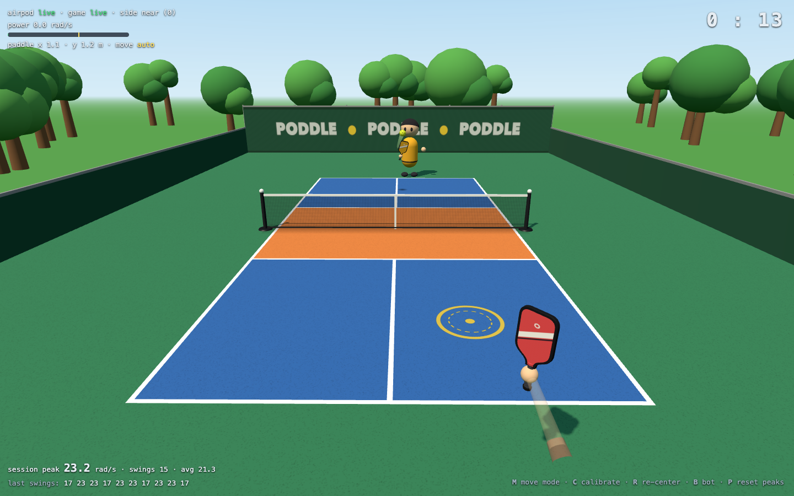

# Poddle 🏓

**Wii-Sports-style pickleball where the controller is your phone, or an AirPod.**

Open https://poddleball.com on a computer, scan the code with your phone, and swing it like a paddle: nothing to install.
Play a friend online or the built-in bot.
On a Mac, one AirPod can be the paddle instead: AirPods Pro/3/Max have motion sensors (orientation, rotation rate,
acceleration at 50 Hz) that macOS exposes through `CMHeadphoneMotionManager`, and Poddle turns that into a motion controller.



## How it works

```
phone ── pad.html (deviceorientation + devicemotion, web/padmotion.js) ──wss──▶ server/game.js ──▶ browser   (nothing installed)
AirPod ──BLE──▶ motion/ (Swift, CoreMotion) ──stdout JSON──▶ bridge/ (ws :8787) ──▶ browser
                                                                                   │  web/motion.js  calibration, aim, swing detection, arm model
                                                                                   │  web/scene.js   three.js court, paddles, ball, audio
browser ◀──────────────── ws :8080 ────────────────▶ server/game.js  serves web/, rooms, authoritative ball, contact, scoring, bot
```

- **A phone is a paddle with no install.** The game tab makes up a 6 character code and shows it as a QR. The phone opens
  `pad.html?k=CODE`, turns its motion events into the same `{t, q, r, a}` sample the AirPod bridge sends, and the game
  server passes each one to that tab (`?pad=` / `?padfor=`, test/pad.test.mjs). From there on MotionModel cannot tell a
  phone from an AirPod. Browsers disagree on which axis `rotationRate.alpha` is, so padmotion.js works it out from how the
  orientation actually turned.
- **There is no position sensor.** A motion sensor can't tell where your hand is (double-integrated acceleration drifts in
  about a second), so Poddle is built on what the sensor is good at: *orientation* and *rotation rate*.
- **Jitter buffer:** real AirPods deliver samples in pairs every ~40 ms with gaps to ~80 ms, so the paddle is rendered
  ~65 ms in the past and only ever interpolates between real samples (roughness 565% -> 9% of a frame step).
- **Two-step calibration** makes it grip-independent: hold still for 5 s, then tip the AirPod up. The tilt axis tells the
  game which way is "right" and "up" for however you're holding it and whichever way you're facing.
- **Real sideways movement comes from the webcam** (`web/bodytrack.js`): a face detector, with a body-pose fallback,
  tracks where you stand and maps the camera's view onto the court, at any distance.
- **Or footwork can be automatic, like Wii Sports tennis** (which never tracked where you stood either). The game runs you
  to the ball at a finite speed; you own the timing, direction, power and lob of the swing. Without a camera the game
  starts in aim-move (press **M** to switch), where turning the AirPod left/right moves the paddle across the court instead.
- **Swings need range of motion, not a wrist flick.** Power = peak rotation rate x credit for the angle swept and how
  long the motion lasted, so a 50° flick scores nothing while a 130° forehand scores ~30 and a backhand ~16-20. Sweep
  direction aims the shot, an upward scoop lobs it, peak speed sets power. The aim is locked from just before the
  wind-up until your hand comes back, so a follow-through doesn't drag you across the court.
- **Kinematic arm:** the on-screen paddle sits at the end of a virtual arm, so a swing sweeps through a real arc
  instead of spinning in place.
- **Fair hit registration:** a swing opens a ~0.3 s window and the hit lands on the server tick where the ball is
  actually inside the contact box around your paddle. The server reports why each swing missed (early / late / left /
  right / high / low).

## Play online

Open https://poddleball.com on a computer, press Play and pick a court. The set-up screen shows a QR code: scan it with
your phone, tap Start, and the phone is your paddle. Nothing to install, any computer, any modern phone (an iPhone asks
to allow motion once per visit). No camera on the phone? Open `poddleball.com/pad` and type the code.

### With an AirPod instead (Mac only)

Download **[Poddle Helper](https://poddleball.com/download/Poddle-Helper.zip)**, a small menu-bar app that passes your
AirPod's motion to the game. It is open source in its own repo:
[danielrltan/poddle-helper](https://github.com/danielrltan/poddle-helper). It reads only headphone motion and sends it only
to the Poddle page in your browser on the same Mac (127.0.0.1:8787); it never connects to the internet itself.

1. Unzip it and open **Poddle Helper.app**. It is not signed with an Apple Developer ID yet, so the first time macOS says it
   "could not verify" the app: press **Done** (not Move to Trash), then System Settings → Privacy & Security →
   **Open Anyway** (on macOS 14, right-click → Open also works).
2. Allow **Motion & Fitness** when it asks.
3. Needs macOS 14+ and AirPods Pro / 3 / 4 / Max connected to the Mac **as the audio output**. Turn **off** *Automatic Ear
   Detection* (Settings → Bluetooth → AirPods ⓘ) so motion keeps streaming out of your ear. Leave the other AirPod in its case.
4. On the set-up screen press **Playing with an AirPod?** (remembered from then on; Chrome asks once to let the page reach
   the helper on your Mac).

Quit it from its menu-bar icon; uninstall by dragging it to the Trash.

**For development**, the old Node bridge in this repo still works in place of the app (Node 18+):

```bash
npm install && ./motion/build.sh
node bridge/bridge.js
```

Type your name once, press Play, then Quick play, Create court, Enter code, or Play a bot (Matt: Rookie, Club or Pro).
Courts have a 4-character code and a link (`?court=CODE`) to share. Alone on a court? Matt walks in after 2.5 s. With two
players the serve waits until both have calibrated. A full court can be watched (`?court=CODE&watch=1`, or Watch in the
court list): broadcast, split screen, either player's view, or a free camera (keys 1 to 4). When a match ends both players
vote on a rematch; if either says no, everyone goes back to the lobby. A player whose connection drops keeps the seat for 15 s.

## Run it locally

```bash
npm install
./motion/build.sh                          # builds the Swift motion reader
node server/game.js                        # the game and the page, on :8080 (the host only)
node bridge/bridge.js                      # every player's Mac
```

- Open `http://localhost:8080`
- Second player on the same network: run `node server/game.js` and `node bridge/bridge.js` too, then open `http://localhost:8080/#<host-LAN-IP>`
  (opening `http://<host-LAN-IP>:8080` directly also works, but Chrome blocks the camera on a non-localhost http page, so you get aim-move)

Keys: **C** calibrate · **Esc** or the top-left button opens Settings (name, sensitivity, how you move: body / auto / aim, Matt's difficulty, leave court; against Matt it pauses the match) · **1 2 3** Matt's difficulty · **B** adds Matt or steps his level · **[ ]** range · **R** re-center (aim drifts over minutes) · **V** AirPod view · **H** stats · **F** full screen · **P** reset swing stats · **Q** twice leaves a court.

## Tests

```bash
node test/motion.test.mjs     # synthetic swings at arbitrary headings/grips (written before the jitter buffer; its latency bounds now fail)
node test/jitter.mjs          # paddle smoothness replaying REAL AirPod arrival timing
node test/zigzag.mjs          # how well fast left-right movement is tracked
node test/rom.mjs             # flicks ignored, arm swings scored
node test/bot.test.mjs        # bot auto-join, levels, comes back when player 2 leaves
node test/server.test.mjs     # rallies, contact box, whiff reasons, scoring, bot, 26k launch solves
node test/rooms.test.mjs      # rooms: quick play, codes, full, leave, reconnect, hostile input
node test/padmotion.test.mjs  # phone paddle: event angles -> samples, rotationRate naming found, MotionModel calibrates on them
node test/pad.test.mjs        # phone paddle: the server passes a phone's samples to its tab and nobody else
node test/pad-e2e.mjs         # phone paddle end to end: the game in one Chrome, pad.html in another, calibrate and rally   (needs Google Chrome)
node test/menu.mjs            # title, lobby and room flow in headless Chrome   (needs Google Chrome)
node test/rooms-e2e.mjs       # two players through the lobby into one court, one Chrome each   (needs Google Chrome)
node test/spectate-e2e.mjs    # three Chromes: Play a bot + pause, a spectator and the four views, rematch, wifi drop, forfeit, status tags   (needs Google Chrome)
node test/e2e.mjs             # headless Chrome + simulated AirPod + bot   (needs Google Chrome)
```
